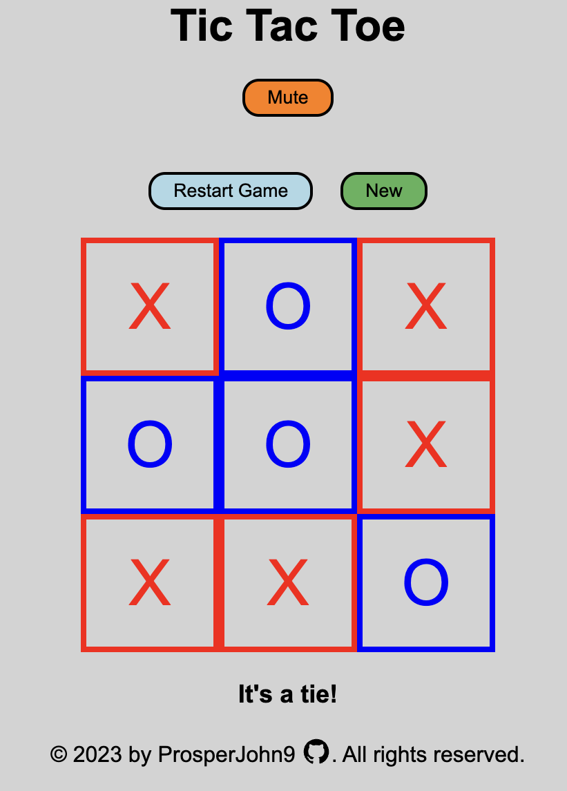

# Tic Tac Toe 
## Description:
This project is a tic tac toe game built with HTML, CSS and Javascript.
The objective of the game is to get three in a row horizontally or vertically or diagonally before your opponent does so as well!
The user can play against an AI with two difficulty modes or against another player.

Live Demo:
https://prosperjohn9.github.io/tic-tac-toe

Desktop View:

This project was created for the [Tic Tac Toe](https://www.theodinproject.com/lessons/node-path-javascript-tic-tac-toe) assignment as part of The Odin Project curriculum. I met all the assignment objectives, including adding the optional AI component and adding levels of difficulty to the AI component, I also added sound effects, mute buttons and options for players to choose their desired symbols. The AI was created using the [Minimax Algorithm](https://en.wikipedia.org/wiki/Minimax), which calculates and scores potential future moves and chooses the best move based on those scores.

## Objectives
1. Store the game board as an array inside of a gameBoard object.
2. Store players in objects.
3. Create object for game flow.
4. Minimize global scope code.
5. Build logic to determine winner/tie.
6. Create AI that chooses random moves.
7. Create unbeatable AI using Minimax Algorithm.
